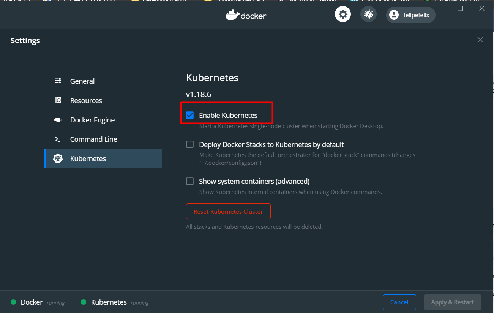

# REQUISITOS
- Ultima versão do [Docker Desktop](https://www.docker.com/products/docker-desktop) instalado (em caso de linux instalar o docker e minikube/microk8s pelo gerenciador de pacotes da distro)

- Habilitar Kubernetes nas configurações do Docker Desktop

    

# LINKS DE INTRODUÇÃO AO KUBERNETES
- [Kubernetes in 5 minutes](https://www.youtube.com/watch?v=PH-2FfFD2PU&feature=youtu.be)
- [Linux Tips - Youtube](https://www.youtube.com/watch?v=zz1p3gjyHgc)
- https://github.com/badtuxx/DescomplicandoKuberneteshttps://github.com/badtuxx/DescomplicandoKubernetes
- https://kubernetes.io/docs/concepts/overview/what-is-kubernetes/
- https://www.cncf.io/the-childrens-illustrated-guide-to-kubernetes/
- https://kumulus.com.br/pt/aprenda-sobre-kubernetes-2/
- https://www.redhat.com/pt-br/topics/containers/what-is-kubernetes
- https://www.digitalocean.com/community/cheatsheets/getting-started-with-kubernetes-a-kubectl-cheat-sheet-pt

# CONHECENDO O KUBECTL

[Kubernetes Cheatsheet](https://kubernetes.io/pt/docs/reference/kubectl/cheatsheet/)

Abaixo alguns comandos comuns e bem úteis para o dia a dia.

#### Nodes
    - kubectl get nods [Lista todos os nós do cluster]

#### Namespaces
    - kubectl get namespaces [Lista os namespaces do cluster]
    - kubectl create namespace tutorial-k8s [Cria um novo namespace]
    - kubectl delete namespace tutorial-k8s* [Remove um namespace]
        O comando de delete namespace é preciso tomar muito cuidado pois como o Namespace funciona com uma "gaveta organizadora" dos componetnes e objetos do kubernetes ao remover o namespace tudo que esta abaixo desse organizador será apagado também.
    
#### Services
    - kubectl get services [Lista os serviços contidos no namespace default]
    - kubectl get services -n tutorial-k8s [Lista os serviços contidos no namespace tutorial-k8s]

#### Deployments
    - kubectl get deployments [Lista os deployments contidos no namespace default]
    - kubectl get deployments -n tutorial-k8s [Lista os deployments contidos no namespace tutorial-k8s]
    - kubectl logs deployments/app1 -n tutorial-k8s [Exibe os logs deployments contidos no deployment app1 dentro do namespace tutorial-k8s]

#### Pods
    - kubectl get pods [Lista os pods contidos no namespace default]
    - kubectl get pods -n tutorial-k8s [Lista os pods contidos no namespace tutorial-k8s]
    - kubectl logs pods/nome-do-pod -n tutorial-k8s [Exibe os logs do pod nome-do-pod dentro do namespace tutorial-k8s]

# INSTALAÇÃO DO HELM

- [Quickstart Helm v3](https://helm.sh/docs/intro/quickstart/)

Tendo o kubernetes rodando para instalar o Helm em sua versão basta executar os seguintes comandos:

    - Instalar o helm v3:
        Mac OS -> brew install helm
        Windows -> choco install kubernetes-helm ou scoop install helm

    - Uma vez instalado devemos initializar a configuração do Helm adicionando o repositório base:
        helm repo add stable https://kubernetes-charts.storage.googleapis.com/

    - Adicionado o repositório vamos listas os aplicativos disponiveis no repositório:
        helm search repo stable

# INSTALANDO REGISTRY LOCAL
    - docker run -d -p 5000:5000 --restart=always --name registry registry:2

#### Configurando o Local Registry no Docker Desktop
    {
        "registry-mirrors": [],
        "insecure-registries": [ "localhost:5000", "127.0.0.1:5000" ],
        "debug": true,
        "experimental": true
    }

# INSTALANDO O CONTROLADOR DE INGRESSO (Ingress Controller)
##### Conhecido também como roteador de borda (Edge Router)

Esse exemplo utiliza o Nginx Ingress Controller, mas temos muitas outras aplicações no ecosistema do kubernetes que fazem o mesmo trabalho, cada uma com sua vantagem e desvantages.

Links tutoriais
- [Digital Ocean Tutorial](https://www.digitalocean.com/community/tutorials/how-to-set-up-an-nginx-ingress-with-cert-manager-on-digitalocean-kubernetes-pt)
- [Medium Itnext Tutorial](https://itnext.io/deploying-tls-certificates-for-local-development-and-production-using-kubernetes-cert-manager-9ab46abdd569)

Para instalação do Nginx no nosso cluster devemos executar o seguinte comando:

    - helm install stable/nginx-ingress --generate-name

Utilizaremos esta saída do comando mais pra frente.
---
    NOTES:
    The nginx-ingress controller has been installed.
    It may take a few minutes for the LoadBalancer IP to be available.
    You can watch the status by running 'kubectl --namespace default get services -o wide -w nginx-ingress-1596214257-controller'

    An example Ingress that makes use of the controller:

    apiVersion: extensions/v1beta1
    kind: Ingress
    metadata:
        annotations:
        kubernetes.io/ingress.class: nginx
        name: example
        namespace: foo
    spec:
        rules:
        - host: www.example.com
            http:
            paths:
                - backend:
                    serviceName: exampleService
                    servicePort: 80
                path: /
        # This section is only required if TLS is to be enabled for the Ingress
        tls:
            - hosts:
                - www.example.com
            secretName: example-tls

    If TLS is enabled for the Ingress, a Secret containing the certificate and key must also be provided:

    apiVersion: v1
    kind: Secret
    metadata:
        name: example-tls
        namespace: foo
    data:
        tls.crt: <base64 encoded cert>
        tls.key: <base64 encoded key>
    type: kubernetes.io/tls
---